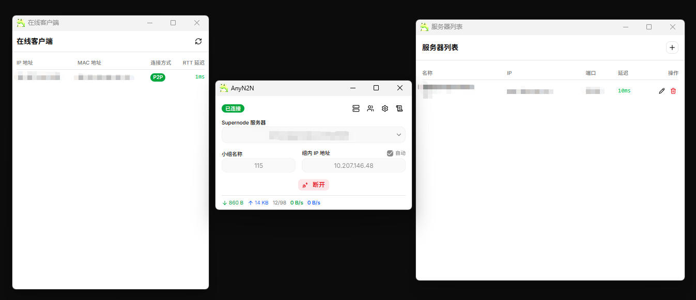

# AnyN2N

基于 n2n v3 的上层tauri + rust客户端，用于快速搭建局域网来达成局域网游戏联机等目的。把 n2n edge 作为后台进程管理，提供多配置保存、实时流量统计、防火墙一键放行、日志监控等便捷功能。

支持 Windows、macOS、Linux。

<p align="center"></p>

## 开发

```bash
bun install
bun run tauri dev     # 需要管理员权限
```

## 构建

```bash
bun run tauri build
```

Windows可以运行build-portable.ps1来构建portable单文件版本。

Edge 二进制和 `wintun.dll` 提前放入 `src-tauri/binaries/`。

## Edge 二进制构建

引用自 [lucktu/n2n](https://github.com/lucktu/n2n)，感谢 lucktu 维护的跨平台 n2n 构建。

## 许可

MIT
